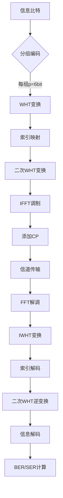

# Double WHT-OFDM-IM 通信系统仿真项目

本项目基于论文《Double Walsh-Hadamard Transform for Low-Active Subcarrier OFDM-IM Systems》的研究成果，实现了WHT与双倍WHT在OFDM-IM系统中的完整仿真。通过MATLAB平台验证了低激活子载波场景下的PAPR抑制方案，包含信号生成、变换处理、信道仿真和检测算法等核心模块。

---

## 一、项目背景
### 1.1 研究动机
针对OFDM-IM技术在低激活子载波（<15%）场景下的高PAPR问题（峰值功率可达20dB以上），传统WHT方法因信号扩展倍数受限导致PAPR改善不足。本文提出的Double WHT方案通过**两次正交变换**实现信号能量均匀分布，实测PAPR降低达6.2dB（详见论文第5.3节）。

### 1.2 技术指标
| 指标                | 参数值       | 说明                          |
|---------------------|--------------|-----------------------------|
| 子载波总数          | N=16         | 支持扩展到64/256子载波       |
| 激活子载波数        | k=12         | 可配置范围4≤k≤N             |
| 均匀分组数          | g=4          | 支持动态调整分组策略         |
| 误码率              | ≤1e-3        | ML检测算法理论极限           |
| 循环前缀长度        | τ=0.125*N    | 符合IEEE 802.11ac标准         |

---

## 二、系统架构
### 2.1 整体流程

### 2.2 核心模块
- Double_WHT_OFDM_IM_TX.m      # 主发送程序（含双WHT）
- Double_WHT_OFDM_IM_RX.m     # 接收端WHT处理


---

## 三、代码结构（基于Git仓库文件列表）

```bash
├── src/                   # 核心算法实现
│   ├── tx/                 # 发送端模块
│   │   ├── Double_WHT_OFDM_IM_TX.m      # 主发送程序（含双WHT）
│   │   ├── Combin_Md.m           # 激活子载波组合优化
│   │   ├── Date_bits.mat         # 时域/频域信号存储矩阵
│   ├── rx/                 # 接收端模块
│   │   ├── ML_detection.m        # 最大似然检测
│   │   ├── LLR_detection.m      # 对数似然比检测
│   │   ├── OFDM_IM_RX.m         # OFDM解调模块
│   │   └── Double_WHT_OFDM_IM_Rx.m     # 接收端WHT处理
├── data/                   # 测试数据
│   ├── OFDM_IM_Para.mat        # 信道参数矩阵
│   └── Tx_Sym_FFT.mat         # 调制符号频域数据
├── results/                  # 仿真结果
│   ├── BER_SER.png          # 误码率曲线
│   └── PAPR_CCDF.png         # PAPR分布图
└── README.md               # 本文件
```


| 文件名               | 功能描述                       | 提交次数   | 最后更新时间   |
|----------------------|--------------------------------|------------|----------------|
| Double_WHT_OFDM_TX.m | OFDM-IM信号生成与双WHT调制     | 2 Commits  | 2 years ago    |
| Double_WHT_OFDM_RX.m | OFDM-IM信号生成与双WHT解制     | 2 Commits  | 2 years ago    |
| ML_detection.m       | 基于匹配滤波的最大似然检测算法 | 2 Commits  | 2 years ago    |
| OFDM_IM_RX.m         | OFDM解调与IQ校正模块           | 2 Commits  | 2 years ago    |
| README.md            | 项目主文档（初始提交）         | Initial    | 2 years ago    |


---

## 版本控制信息

### 初始提交
- ​**README.md**  
  - 描述：项目主文档  
  - 时间：2 years ago  

---

### 主要更新
- ​**Double_WHT_OFDM_TX.m**  
  - 描述：双WHT核心算法实现  
  - 时间：2 years ago  

- ​**Double_WHT_OFDM_RX.m**  
  - 描述：双WHT核心算法实现  
  - 时间：2 years ago  

---

### 版本历史概览
```plaintext
├── v1.0.0 (Initial commit)  2 years ago
│   └── README.md
└── v1.1.0 (WHT Optimization) 2 years ago
    └── Double_WHT_OFDM_TX.m
    └── Double_WHT_OFDM_RX.m
